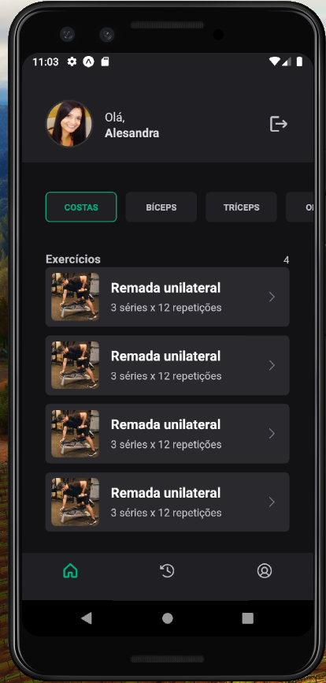
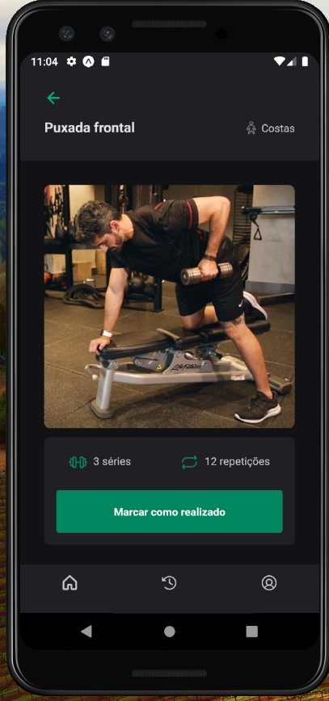

# Aplicacáo Gym em React Native

## Ferramentas utilizadas

-> Expo
-> NativeBase
-> Stack Navigator
-> Image Picker e File System
-> React Hook Form e Schema Validation

## Tela

     
     
     
     

<video width="320" height="240" controls>
  <source src="./src/assets/telas.mp4" type="video/mp4">
  Your browser does not support the video tag.
</video>
